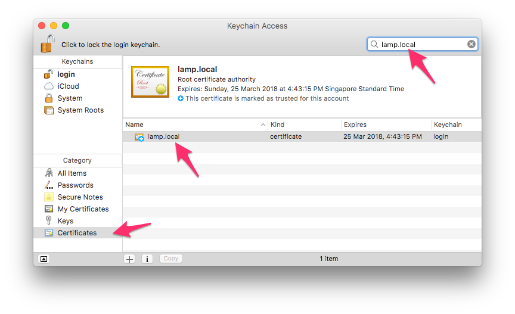

# demo

> Demo of a secure and insecure web page

## Getting started

1. Install dependancies with `npm i`
1. Generate new certificates `key.pem` and `cert.pem`
    - Ensure `Common Name` is `localhost` or another domain name E.g. `secure.local`

        ```sh
        $ openssl req -x509 -newkey rsa:2048 -keyout key.pem -out cert.pem -days 365

        Generating a 2048 bit RSA private key
        ......................+++
        ..........+++
        writing new private key to 'key.pem'
        Enter PEM pass phrase:
        Verifying - Enter PEM pass phrase:
        -----
        You are about to be asked to enter information that will be incorporated
        into your certificate request.
        What you are about to enter is what is called a Distinguished Name or a DN.
        There are quite a few fields but you can leave some blank
        For some fields there will be a default value,
        If you enter '.', the field will be left blank.
        -----
        Country Name (2 letter code) [AU]:SG
        State or Province Name (full name) [Some-State]:Singapore
        Locality Name (eg, city) []:Singapore
        Organization Name (eg, company) [Internet Widgits Pty Ltd]:IoT security demo
        Organizational Unit Name (eg, section) []:
        Common Name (e.g. server FQDN or YOUR name) []:localhost
        Email Address []:sayanee@gmail.com
        ```
1. Add the certificates to KeyChain app
1. Ensure it is `Always Trust`

    
1. Ensure that common Name on certificate generation and domain name is `localhost`

    
1. Start the servers on host machine to test

    ```sh
    npm start
    ```
1. Visit <http://localhost:4000> and <https://localhost:5000> in browser
